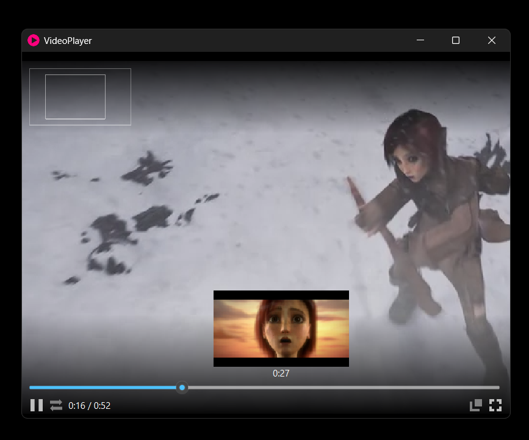

# What is it

A simple video player made using [Qt Multimedia](https://doc.qt.io/qt-6/qtmultimedia-index.html) and [OpenCV](https://opencv.org/).

# Features

1. Always on top mode
2. Thumbnail preview when hovering on slider
3. Zoom in using `right mouse hold + mouse wheel up`
4. Pan using `right mouse drag`
5. Map at the top-left corner when zooming in and panning
6. Toggle play/pause using `left mouse click` or `space key`
7. Play video at 2x playback speed using `left mouse hold` or `space key hold`
8. Toggle fullscreen using `left mouse double click`
9. Seek backward/forward 7 seconds using `left/right key`
10. Loop mode